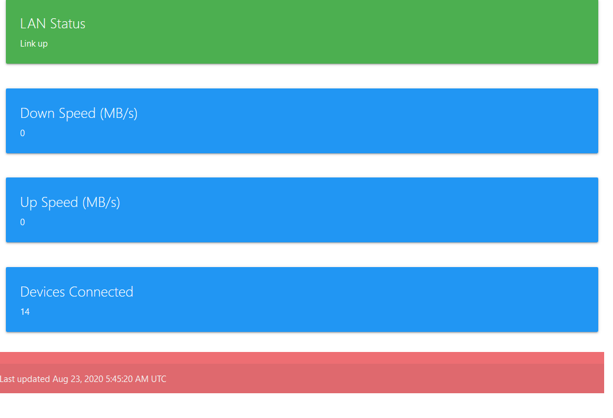

# orbi-live-dashboard

Live dashboard for orbi router - meant to be run on a raspberry pi

## Running the dashboard

1. Install python3.7
1. Download this repo
1. Install all pip requirnments in `requirnments.txt`
1. Update your admin password and `orbi` router admin url in `run_local.sh`
1. Run `./run_local.sh`

The dashboard should be on `localhost:8091` be default
